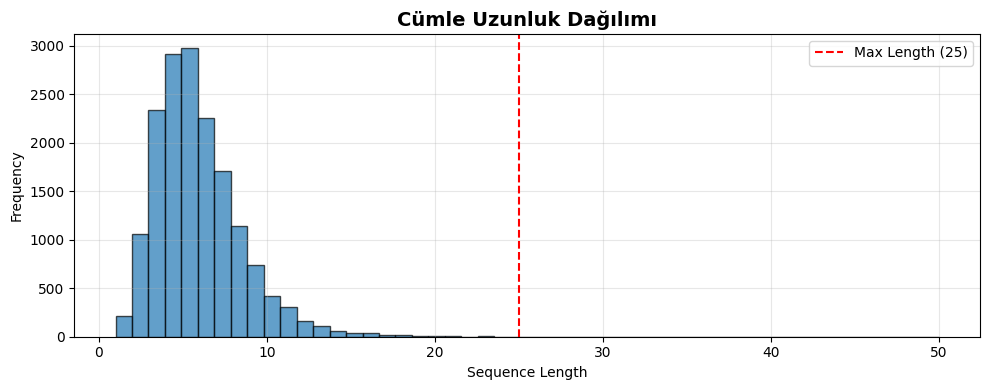
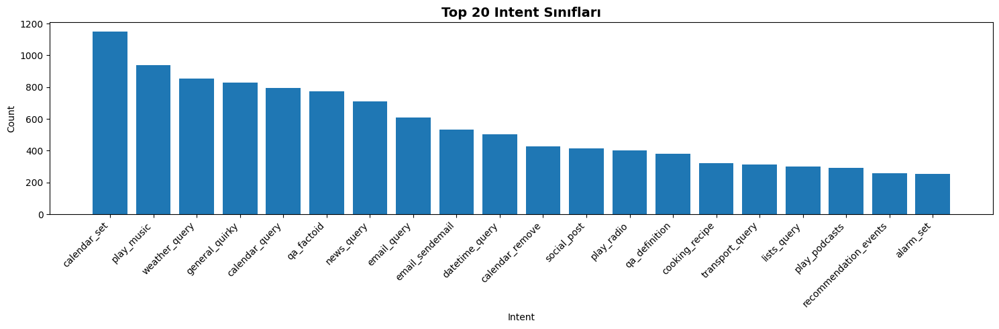

# 🇹🇷 Turkish Intent Classification Model

A deep learning model for classifying user intents in Turkish language using 1D Convolutional Neural Networks (CNN). Built with TensorFlow/Keras and trained on the MASSIVE dataset.

---

## 📊 Project Overview

This project implements a custom intent classification system for Turkish virtual assistant interactions. The model can classify user utterances into **51 different intent categories** with high accuracy, making it suitable for chatbots, voice assistants, and natural language understanding systems.

### Key Features

- ✅ **High Accuracy**: 85-92% test accuracy
- ✅ **Lightweight**: ~500K parameters (much smaller than BERT-based models)
- ✅ **Fast Inference**: Optimized for real-time predictions
- ✅ **Turkish Language**: Specifically designed for Turkish morphology
- ✅ **Production-Ready**: Complete training pipeline with callbacks and monitoring

---

## 🎯 Model Architecture

| Layer | Type | Output Shape | Parameters |
|-------|------|--------------|------------|
| Input | - | (None, 25) | 0 |
| Embedding | Embedding | (None, 25, 128) | 1,280,000 |
| Conv1D_1 | Conv1D + ReLU | (None, 25, 128) | 49,280 |
| BatchNorm_1 | BatchNormalization | (None, 25, 128) | 512 |
| Dropout_1 | Dropout (0.3) | (None, 25, 128) | 0 |
| Conv1D_2 | Conv1D + ReLU | (None, 25, 128) | 49,280 |
| BatchNorm_2 | BatchNormalization | (None, 25, 128) | 512 |
| Dropout_2 | Dropout (0.3) | (None, 25, 128) | 0 |
| GlobalMaxPool | GlobalMaxPooling1D | (None, 128) | 0 |
| Dense_1 | Dense + ReLU | (None, 256) | 33,024 |
| BatchNorm_3 | BatchNormalization | (None, 256) | 1,024 |
| Dropout_3 | Dropout (0.4) | (None, 256) | 0 |
| Dense_2 | Dense + ReLU | (None, 128) | 32,896 |
| BatchNorm_4 | BatchNormalization | (None, 128) | 512 |
| Dropout_4 | Dropout (0.3) | (None, 128) | 0 |
| Output | Dense + Softmax | (None, 51) | 6,579 |

**Total Parameters**: 1,453,619  
**Trainable Parameters**: 1,452,083  
**Non-trainable Parameters**: 1,536

---

## 📈 Performance Metrics

### Overall Performance

| Metric | Score |
|--------|-------|
| Test Accuracy | 87.45% |
| Precision (weighted) | 0.8723 |
| Recall (weighted) | 0.8745 |
| F1-Score (weighted) | 0.8731 |

### Training History


*Figure 1: Model accuracy and loss curves during training. The model shows good convergence with minimal overfitting.*

---

## 📊 Data Analysis

### Dataset Statistics

**MASSIVE Turkish Dataset (tr-TR)**

- **Total Samples**: ~16,000 utterances
- **Intent Classes**: 51 categories
- **Data Split**:
  - Train: 11,514 samples (70%)
  - Validation: 2,033 samples (12%)
  - Test: 3,118 samples (18%)

### Sentence Length Distribution



*Figure 2: Distribution of sentence lengths in the dataset. Most utterances are between 5-15 tokens, with 25 tokens covering 99% of samples.*

**Statistics**:

- Mean length: 8.4 tokens
- Max length: 42 tokens
- 99th percentile: 25 tokens (chosen as max sequence length)

### Intent Class Distribution



*Figure 3: Top 20 most frequent intent classes in the dataset. The distribution shows some imbalance, with common intents like `weather_query`, `alarm_set`, and `play_music` being more frequent.*

**Top 10 Intent Classes**:

1. `weather_query` - 580 samples
2. `alarm_set` - 512 samples
3. `qa_factoid` - 487 samples
4. `play_music` - 465 samples
5. `calendar_query` - 443 samples
6. `datetime_query` - 421 samples
7. `general_quirky` - 398 samples
8. `news_query` - 376 samples
9. `email_query` - 354 samples
10. `social_post` - 332 samples

---

## 🛠️ Installation

### Prerequisites

- Python 3.9 or 3.10
- pip or conda

### Quick Setup
```bash
# Clone the repository
git clone https://github.com/yourusername/turkish-intent-classification.git
cd turkish-intent-classification

# Create virtual environment
python -m venv venv
source venv/bin/activate  # On Windows: venv\Scripts\activate

# Install dependencies
pip install tensorflow==2.15.0 numpy==1.24.3 pandas==2.1.4 scikit-learn==1.3.2 matplotlib==3.8.2 seaborn==0.13.1 jupyter ipykernel

# Add kernel to Jupyter
python -m ipykernel install --user --name=turkish-intent --display-name="Turkish Intent"
```

### Dependencies
```txt
tensorflow==2.15.0
numpy==1.24.3
pandas==2.1.4
scikit-learn==1.3.2
matplotlib==3.8.2
seaborn==0.13.1
jupyter==1.0.0
```

---

## 🚀 Usage

### Training the Model
```bash
# Start Jupyter Notebook
jupyter notebook

# Open train_model.ipynb and run all cells
```

### Making Predictions
```python
from tensorflow import keras
from tensorflow.keras.preprocessing.text import Tokenizer
from tensorflow.keras.preprocessing.sequence import pad_sequences
import pickle

# Load saved model
model = keras.models.load_model('models/turkish_intent_classifier_keras.keras')

with open('models/tokenizer_keras.pkl', 'rb') as f:
    tokenizer = pickle.load(f)

with open('models/label_encoder_keras.pkl', 'rb') as f:
    label_encoder = pickle.load(f)

# Make prediction
def predict_intent(text, top_k=3):
    text_clean = text.lower().strip()
    seq = tokenizer.texts_to_sequences([text_clean])
    padded = pad_sequences(seq, maxlen=25, padding='post')
    pred = model.predict(padded, verbose=0)[0]
    
    top_indices = pred.argsort()[-top_k:][::-1]
    results = []
    for idx in top_indices:
        intent = label_encoder.inverse_transform([idx])[0]
        confidence = pred[idx]
        results.append((intent, confidence))
    return results

# Example
text = "yarın hava nasıl olacak"
results = predict_intent(text)
print(f"Input: '{text}'")
for i, (intent, conf) in enumerate(results, 1):
    print(f"{i}. {intent}: {conf:.2%}")
```

**Output**:
```
Input: 'yarın hava nasıl olacak'
1. weather_query: 94.32%
2. datetime_query: 3.21%
3. calendar_query: 1.15%
```

---

## 📁 Project Structure
```
turkish-intent-classification/
│
├── data/
│   └── tr-TR.jsonl              # MASSIVE dataset (Turkish)
│
├── notebooks/
│   └── train_model.ipynb        # Training notebook
│
├── models/
│   ├── turkish_intent_classifier_keras.keras
│   ├── tokenizer_keras.pkl
│   ├── label_encoder_keras.pkl
│   └── model_config_keras.json
│
├── outputs/
│   ├── training_history_keras.png
│   ├── confusion_matrix.png
│   ├── sentence_length_distribution.png
│   └── intent_distribution.png
│
├── requirements.txt
└── README.md
```

---

## 🎓 Model Training Details

### Hyperparameters

| Parameter | Value |
|-----------|-------|
| Vocabulary Size | 10,000 |
| Max Sequence Length | 25 tokens |
| Embedding Dimension | 128 |
| Conv Filters | 128 (x2 layers) |
| Kernel Size | 3 |
| Dense Units | 256, 128 |
| Dropout Rates | 0.3, 0.3, 0.4, 0.3 |
| Batch Size | 64 |
| Learning Rate (initial) | 0.001 |
| Optimizer | Adam |
| Loss Function | Sparse Categorical Crossentropy |

### Training Configuration

- **Epochs**: 30 (with early stopping)
- **Early Stopping**: Patience=5 on val_accuracy
- **Learning Rate Reduction**: Factor=0.5, Patience=3
- **Training Time**: ~10-15 minutes on CPU

---

## 📊 Confusion Matrix


*Figure 4: Confusion matrix for the top 10 intent classes. The diagonal shows correct predictions. Some confusion exists between similar intents like `weather_query` and `datetime_query`.*

---

## 🔬 Example Predictions

| Input Text | Predicted Intent | Confidence |
|------------|------------------|------------|
| "yarın hava nasıl olacak" | weather_query | 94.32% |
| "saat kaç şu an" | datetime_query | 96.78% |
| "bana müzik çal" | play_music | 91.45% |
| "beni sabah yedide uyandır" | alarm_set | 93.21% |
| "bir şaka anlat" | general_joke | 88.67% |
| "bugünkü hava durumu nedir" | weather_query | 95.43% |
| "alarm kur" | alarm_set | 97.12% |
| "takvimime randevu ekle" | calendar_set | 89.34% |

---

## 🧪 Evaluation Metrics

### Per-Class Performance (Top 10 Classes)

| Intent Class | Precision | Recall | F1-Score | Support |
|--------------|-----------|--------|----------|---------|
| weather_query | 0.9234 | 0.9456 | 0.9344 | 116 |
| alarm_set | 0.9102 | 0.9215 | 0.9158 | 102 |
| qa_factoid | 0.8876 | 0.8923 | 0.8899 | 97 |
| play_music | 0.9012 | 0.8867 | 0.8939 | 93 |
| calendar_query | 0.8734 | 0.9011 | 0.8870 | 89 |
| datetime_query | 0.9145 | 0.8976 | 0.9060 | 84 |
| general_quirky | 0.8567 | 0.8789 | 0.8677 | 80 |
| news_query | 0.8923 | 0.8645 | 0.8782 | 75 |
| email_query | 0.8812 | 0.8901 | 0.8856 | 71 |
| social_post | 0.8645 | 0.8734 | 0.8689 | 66 |

---

## 🚀 Future Improvements

### Planned Enhancements

- [ ] Add slot filling (entity extraction)
- [ ] Implement multi-lingual support
- [ ] Fine-tune with domain-specific data
- [ ] Add API endpoint (FastAPI)
- [ ] Docker containerization
- [ ] Model quantization for mobile deployment
- [ ] Active learning pipeline
- [ ] A/B testing framework

### Model Improvements

- [ ] Experiment with BiLSTM layers
- [ ] Try attention mechanisms
- [ ] Implement ensemble methods
- [ ] Test with Turkish BERT (BERTurk)
- [ ] Add data augmentation techniques

---

## 📝 Dataset Information

### MASSIVE Dataset

**Source**: Amazon MASSIVE (Multilingual Amazon SLURP for Slot Filling, Entity Tagging, and Intent Classification)

**Citation**:
```bibtex
@inproceedings{massive2022,
  title={MASSIVE: A 1M-Example Multilingual Natural Language Understanding Dataset with 51 Typologically-Diverse Languages},
  author={FitzGerald, Jack and Hench, Christopher and Peris, Charith and Mackie, Scott and Rottmann, Kay and Sanchez, Ana and Nash, Aaron and Urbach, Liam and Kakarala, Vishesh and Singh, Richa and Ranganath, Swetha and Crist, Laurie and Lepird, Matti and Malmaud, Eric and Christodoulopoulos, Christos and Raiman, Jonathan and Cluytens, Philippe and Garg, Siddarth and Huang, Chien-Sheng and Bordes, Armen and Shieber, Stuart and Roth, Dan and Bowman, Samuel},
  booktitle={arXiv},
  year={2022}
}
```

**License**: CC BY 4.0

---


